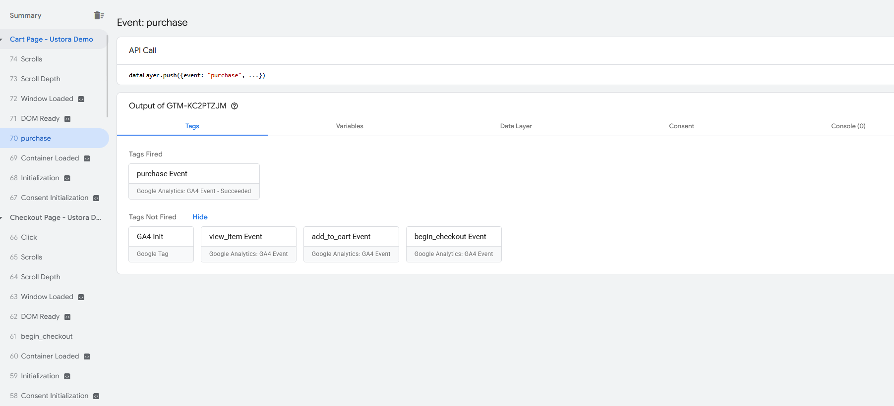
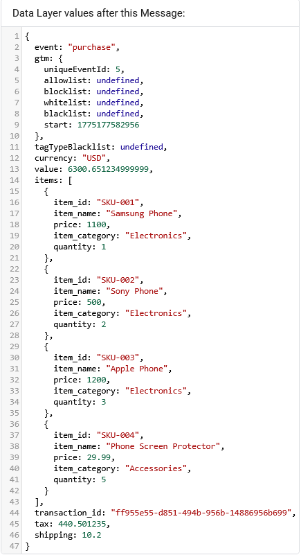
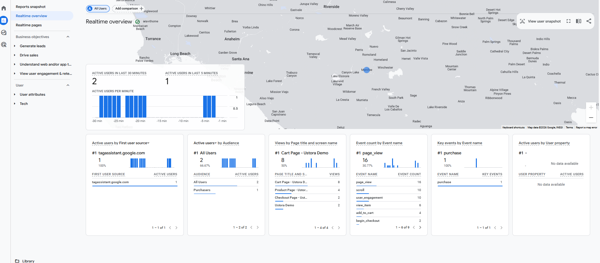
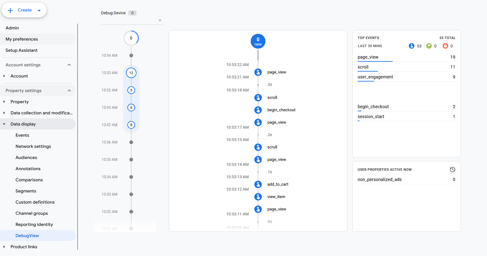
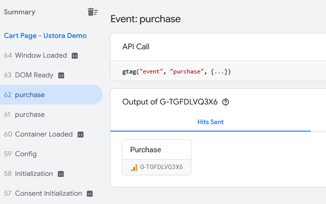

Executive Summary 
A complete GA4 Enhanced Ecommerce tracking implementation was built for the Ustora demo store, enabling visibility into the full customer purchase journey from product viewing through order completion.Events we track are products being viewed, products being added to cart, beginning the checkout process, and completing a purchase order. This implementation allows us to track the entire customer purchase journey and the products of interest.

Implementation Inventory 
### Tags
| Tag | Type | Trigger |
|-----|------|---------|
| GA4 Init | Google Tag | All Pages — Initialization |
| add_to_cart Event| GA4 Event | add_to_cart |
| begin_checkout Event| GA4 Event | begin_checkout |
| purchase Event| GA4 Event | purchase |
| view_item Event| GA4 Event | view_item |

### Triggers
| Trigger | Type | Description |
|---------|------|-------------|
| add_to_cart | Custom Event | Listens for `add_to_cart` event name pushed to DataLayer |
| begin_checkout | Custom Event | Listens for `begin_checkout` event name pushed to DataLayer |
| purchase | Custom Event | Listens for `purchase` event name pushed to DataLayer |
| view_item | Page View | Fires on Page URL containing the `-product` |

### Key Variables
**Auto-collected (built-in):**
- Page URL, Page Path, Page Hostname — for page-level context
-Referrer — for link tracking
- Click URL, Click Text, Click ID, Click Classes — for click event detail
- Scroll Depth Threshold, Scroll Direction — for scroll tracking
- Error Message, Error Line, Error URL — for JS error tracking

**User-defined DataLayer variables:**

| Variable | Description |
|----------|-------------|
| dL_currency | Currency for transaction |
| dL_items | Array consisting of item details |
| dL_shipping | Shipping cost |
| dL_tax | Tax cost of order |
| dL_transaction_id | Purchase id |
| dL_value | Monetary value of the event — product price for view_item and add_to_cart, cart total for begin_checkout and purchase. |
| GA4 ID | Constant — GA4 Measurement ID |

Data Quality Issues — what you found, what the impact is
No remove_from_cart event — we miss data regarding any differences between the cart and begin_checkout. Prevents analysis regarding items that may not make it all the way to purchase.
No quantity update tracking on cart page — changes to cart value before checkout aren't captured. We can lose insight on which items visitors may need more of upon final reflection.

Recommendations — prioritized
Implement remove_from_cart tracking — highest priority, direct data gap. This would require reducing the array and partitioning them into two separate arrays: one being items kept, and the other items removed.
Implement quantity update tracking — medium priority
Replace static tax/shipping with dynamic calculation — production requirement. This would require a backend or API to calculate shipping costs between locations.
Move transaction ID generation server-side — production requirement. Requires a backend or API to generate and store the transaction ID along with the order details
Replace hardcoded product data with CMS-driven dataLayer — production requirement
No form validation or submission — no backend to receive it

Screenshots:
GTM Preview - purchase event
Tag event firing:

DataLayer sent:

GA4 Realtime overview

GA4 DebugView - event stream

